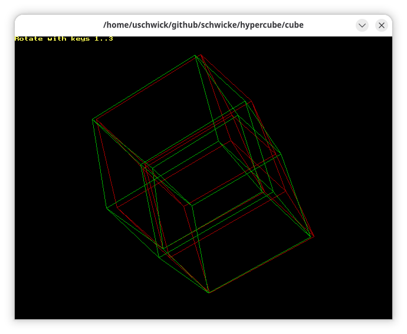

# 3d-projection of N-dimensional hypercube



## Disclaimer
This is a software preservation kind of project. The goal is not to have something which is free of bugs but rather to enjoy getting old code up and running again.

## Introduction

This is a collection of little Pascal based projects that I must have started in the mid 90th of the last century,
maybe around 1996. I stumbled over it on an old backup CD of mine recently, while looking for something entirely unrelated.

The original code was created using Turbo Pascal (on DOS), and was run on a PC with a i387 coprocessor. Bits were written in assembler to gain speed.

The code in this project has been cleaned up a bit, and ported to fpc.
While there are some bugs which would need some attention, it actually works.

Make sure that you have your red-green 3d classes at hand !

# Building
Make sure that you have fpc installed. To build, run
```
make
```

# Running
After successful compilation, the following executables are available:

## 3 dimensional projection of an N-dimensional hypercube:
Start with
```
./cube
```
and enter the number of dimensions. Dimensionality can be between 2 and 9

### Limitations
* Rotation is only possible into one direction, and the rotation angle is hard coded
* The window size is fixed and hard coded

## Simulation of interference of waves
This is a 2 dimensional simulation of interfering waves. Start the simulation with
```
./interfere
```
First enter the number of centers and the time passed.

For each center, the program will then ask you for
* The x and y coordinate (position) of the center. The rendering window has 640x480 pixel, thus 320 240 would be the center
* The amplitude
* The wave length

Press a key to exit.


