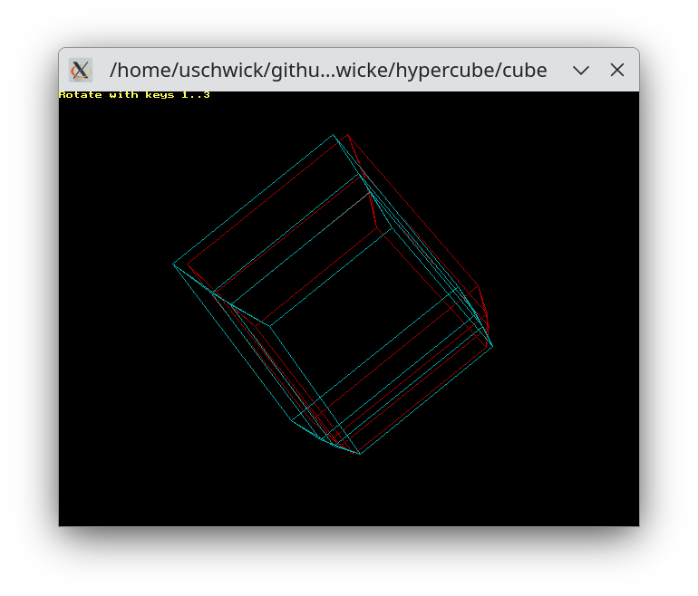
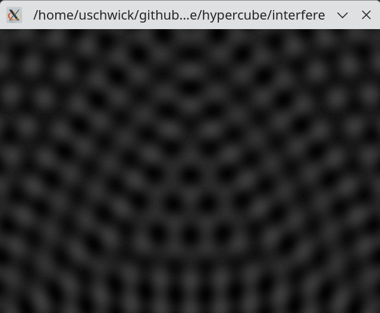

# Recovery of personal ancient Pascal based simulations and programs

## Disclaimer
This is a software preservation kind of project. The goal is not to have something which is free of bugs but rather to enjoy getting old code up and running again.

## Introduction

This is a collection of little Pascal based projects that I must have started in the mid 90th of the last century,
maybe around 1996. I stumbled over it on an old backup CD of mine recently, while looking for something entirely unrelated.

The original code was created using Turbo Pascal (on DOS), and was run on a PC with a i387 coprocessor. Bits were written in assembler to gain speed.

The code in this project has been cleaned up a bit, and ported to fpc.
While there are some bugs which would need some attention, it kind of works.

# Building
Make sure that you have fpc installed. To build, run
```
make
```

# Running
After successful compilation, the following executables are available:

## 3 dimensional projection of an N-dimensional hypercube

Make sure that you have your red-blue 3d classes at hand !

Start with
```
./cube
```
and enter the number of dimensions. Dimensionality can be between 2 and 9. 



You can let it rotate with keys 1, 2, ... , (N-1).

Press esc to terminate. 


### Limitations
* Rotation is only possible into one direction, and the rotation angle is hard coded
* The window size is fixed and hard coded

## Simulation of interference of waves
This is a 2 dimensional simulation of interfering waves. Start the simulation with
```
./interfere
```
First enter the number of centers and the time passed.

For each center, the program will then ask you for

* The x and y coordinate (position) of the center. The rendering window has 640x480 pixel, thus 320 240 would be the center. Note that the program expects two space separated integers numbers as inputs for the positions.
* The amplitude (integer)
* The wave length (integer)

Locations are in pixel. The resolution is hard coded to be 640x480.

For example, 3 centers, at (0, 320), (0, 480) and (640, 480), with amplitude 1 and wavelength 50 results in this:




Press any key in the terminal to exit.


## (First) simulation of a pendulum with two masses 
This is a 2 dimensional simulation of two coupled masses.
Start the simulation with
```
./dpplpndl
```

Graphics are rather minimalistic in this one, but it works.


Press escape to exit.
### Limitations
This simulation currently does not accept any inputs


